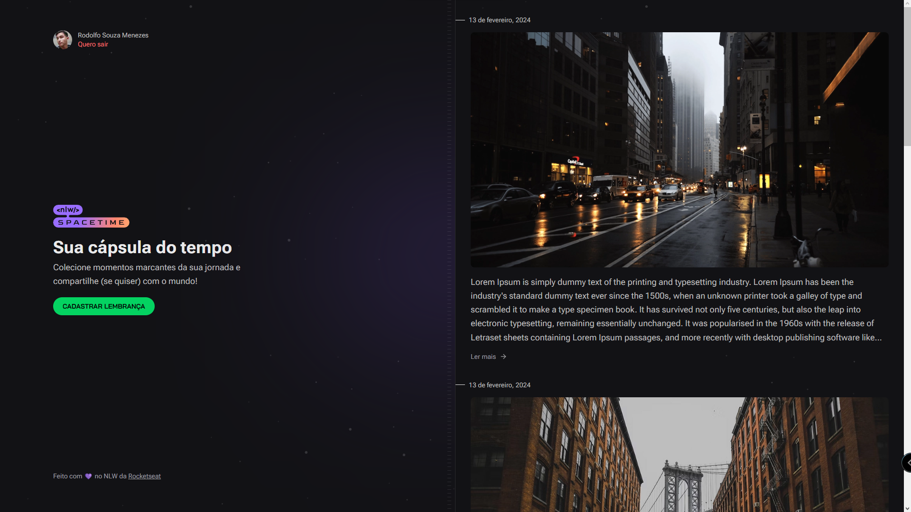

# NLW SPACETIME

-
Aplicação de registro de memórias, utilizadas para se entender conceitos como:

- GitHub OAuth
- Roteamento com Expo Router V2
- Uso de Cookies no Next
- Upload de imagens com Multipart
- Middleware de permissão de rotas autenticadas

Tecnologias usadas: Typescript, NodeJS, Prisma, Fastify, NextJS, ReactJS, React Native e TailwindCSS

No total são três projetos, descubra como utiliza-las entrando em seus respectivos README's
- ### [Server - Ver Manual](https://github.com/rodolfosouzamenezes/nlw-spacetime/tree/master/server)
- ### [Mobile - Ver Manual](https://github.com/rodolfosouzamenezes/nlw-spacetime/tree/master/mobile)
- ### [Web - Ver Manual](https://github.com/rodolfosouzamenezes/nlw-spacetime/tree/master/web)
