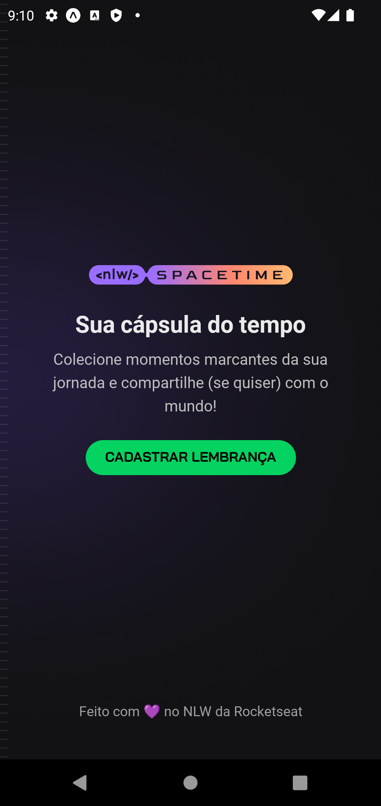
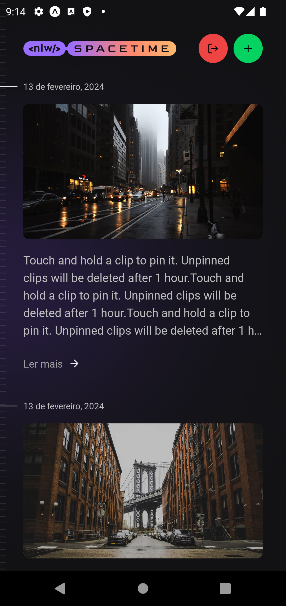
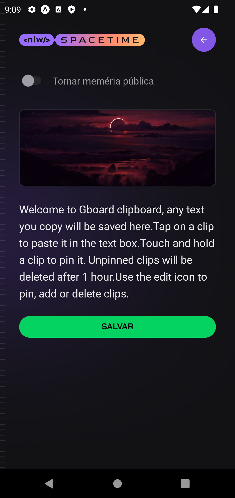

## Manual de uso
### Inicie a API - [Ver Manual](https://github.com/rodolfosouzamenezes/nlw-spacetime/blob/master/server)
### Adicone as Variáveis de Ambiente - [Ver Exemplo](https://github.com/rodolfosouzamenezes/nlw-spacetime/blob/master/mobile/.env.example)
### Inicialiando o Expo
```sh
npm install
```
```sh
npm run start
```
Agora escaneie o QRCODE no app Expo GO ou selecione o emulador desejado

## Tela de cadastro

## Home

## Adicionar nova memória

