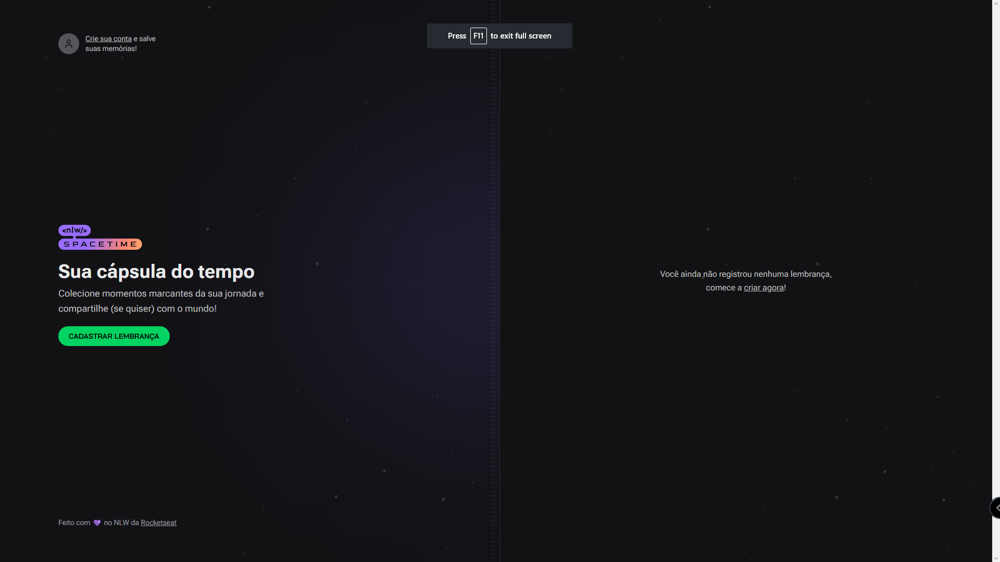
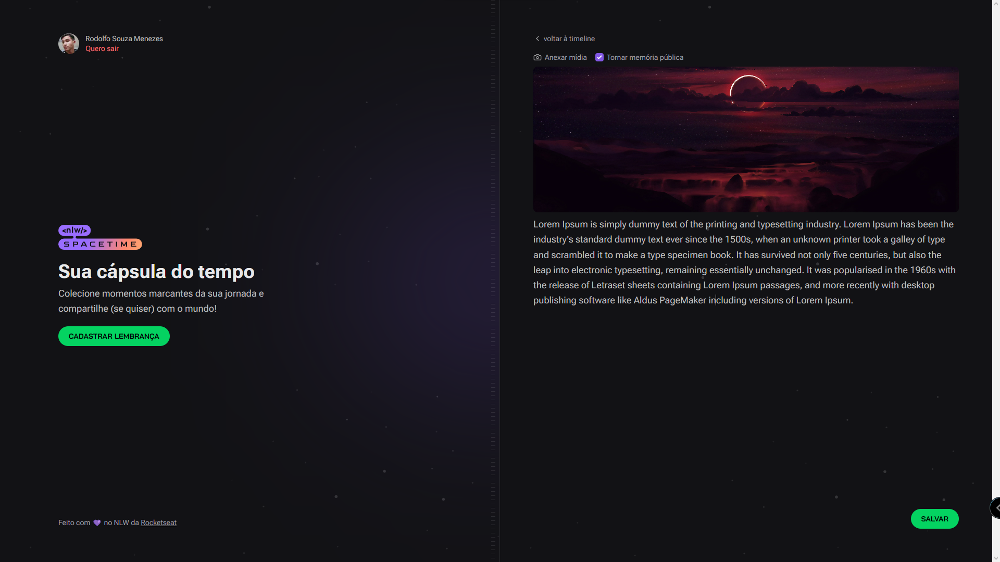

## Manual de uso
### Inicie a API - [Ver Manual](https://github.com/rodolfosouzamenezes/nlw-spacetime/blob/master/server)
### Adicone as Variáveis de Ambiente - [Ver Exemplo](https://github.com/rodolfosouzamenezes/nlw-spacetime/blob/master/web/.env.example)
### Inicialiando o site - [http://localhost:3000/](http://localhost:3000/)
```sh
npm install
```
```sh
npm run dev
```

## Tela de cadastro

## Home

## Adicionar nova memória
